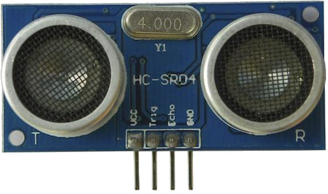

# Ultrasonic HCSR04 Sensor Library and ROS 2 Wrapper
<p align="center">
  
</p>
This repository provides a library and a ROS 2 wrapper for using the HC-SR04 ultrasonic sensor with a Raspberry Pi 3B+.


## Introduction

The HC-SR04 ultrasonic sensor is a popular choice for measuring distances using ultrasonic waves. This repository offers a library that allows you to interface with the sensor on a Raspberry Pi 3B+ and a ROS 2 wrapper that makes it easy to integrate the sensor data into your ROS 2 applications.

## Library

The library provided here offers low-level access to the HC-SR04 sensor for Raspberry Pi 3B+. It includes functions for reading distance and velocity measurements. You can use this library in your non-ROS applications or as a foundation for ROS-based projects.

## ROS 2 Wrapper

The ROS 2 wrapper simplifies the integration of the HC-SR04 sensor with ROS 2 Humble. It creates ROS 2 topics to publish distance and velocity data, allowing you to utilize the sensor in your ROS 2 robotic systems.

## Prerequisites

To use the provided library and ROS 2 wrapper, you'll need:

- A Raspberry Pi 3B+.
- The HC-SR04 ultrasonic sensor.
- ROS 2 Humble installed on your Raspberry Pi.
- wiringPi library to be installed on your Raspberry Pi (clone using [this](https://github.com/WiringPi/WiringPi) repository and build it with: ```cd ~/WiringPi/WiringPi && ./build```).


## Usage

1. Clone this repository to your Raspberry Pi:

    ```bash
    git clone https://github.com/mataruzz/libHCSR04.git
    ```
2. Build and source the wrapper:
    ```bash
    cd libHCSR04/libHCSR04_ros
    colcon build --symlink-install --parallel-workers 2 --executor sequential
    . install/setup.bash
    ```
3. Run the ultrasonic HC-SR04 wrapper:
    ```bash
    ros2 run lib_hcsr04_ros RunUltrasonicHCSR04Wrapper 
    ```

## Reference
- http://wiki.ros.org/Drivers/Tutorials/DistanceMeasurementWithUltrasonicSensorHC-SR04Cpp